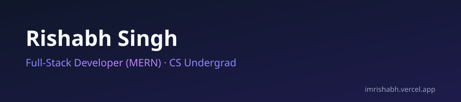

<!--
  Rishabh Singh · GitHub profile README
  banner.svg is hand-built with light SMIL animation.
  IMPORTANT: keep it referenced as . GitHub strips animation
  from SVG pasted inline as markup — as  it animates fine.
-->

  
  
  
  

### Hi, I'm Rishabh 👋

I'm a **Computer Science undergraduate** (B.Tech, PSIT Kanpur) and **full-stack developer** who builds and ships production web apps on the **MERN stack** — React, Node.js, Express, and MongoDB. I like taking a project from a blank repo all the way to a deployed, working link.

Strong foundation in **DSA, OOP, DBMS, and Operating Systems** — with 200+ problems solved on LeetCode & HackerRank to back it up.

---

## 💼 Experience

**Web Development Intern — The Developers Arena** *(May 2026 – Jun 2026, Remote)*
- Built a MongoDB-based e-commerce platform with secure auth & session management
- Built a live weather app integrating a third-party REST API
- Designed and deployed a fully responsive personal portfolio site

---

## 🚀 Featured Projects

<table>
<tr>
<td width="33%" valign="top">

### 🔗 Connectly
*Full-stack social media app*

React.js + Node/Express + MongoDB, with Clerk auth.

- User profiles, posts, likes, comments
- Real-time UI updates
- RESTful APIs with optimized schema design

</td>
<td width="33%" valign="top">

### 📊 LeetSync
*LeetCode stats tracker*

HTML/CSS/JS + REST API integration.

- Tracks problems solved & rankings
- Interactive dashboard
- [Live demo →](https://rishabh6116.github.io/LeetSync/)

</td>
<td width="33%" valign="top">

### ⛅ SkyCast
*Real-time weather app*

HTML/CSS/JS + third-party REST API.

- Live temperature, humidity, conditions
- Location-based search
- [Live demo →](https://rishabh6116.github.io/SkyCast/)

</td>
</tr>
</table>

---

## 🧰 Tech I build with

**Languages** — C · C++ · Python · JavaScript  
**Web** — HTML · CSS · React.js · Node.js · Express.js · REST APIs  
**Databases** — MongoDB · SQL · MySQL  
**Tools & Platforms** — Git · GitHub · Linux · VS Code · Vercel · Render · Firebase · Cloudinary · Jupyter Notebook  
**Core CS** — Data Structures & Algorithms · OOP · DBMS · Operating Systems  

  
  
  
  
  
  
  
  
  
  
  
  

---

## 📈 GitHub Stats

  
  

  

---

## 🏆 Certifications

- HTML, CSS, and Python Certification — Infosys Springboard
- Artificial Intelligence Certification — Oracle
- 200+ DSA problems solved on LeetCode & HackerRank

---

## 🧭 Currently

**Learning / building** — MERN stack projects · Data Structures & Algorithms  
**Open to** — Software Developer internships & full-time roles

---

## 🤝 Connect

 

> *Turning ideas into deployed, working code — one project at a time.*
